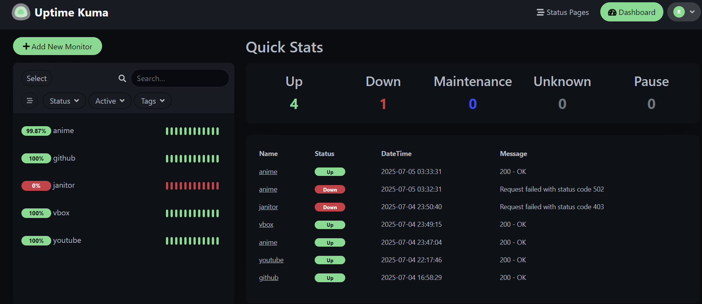

# 🚀 UptimePro – Cloud Uptime Monitoring with Uptime Kuma

## 🌐 Live Demo

🔗 [rohanuptime.duckdns.org/status/uptime](https://rohanuptime.duckdns.org/status/uptime)

---

## 📖 About the Project

This project deploys [Uptime Kuma](https://github.com/louislam/uptime-kuma), a self-hosted uptime monitoring tool, on an AWS EC2 instance using Docker and Docker Compose. It includes NGINX for reverse proxying, SSL configuration via Let's Encrypt, and public access via a DuckDNS domain.

The goal was to set up a production-like cloud monitoring environment using standard DevOps practices.

---

## 🛠️ Tech Stack

- **AWS EC2 (Ubuntu 24.04)** – Cloud infrastructure
- **Docker & Docker Compose** – Application containerization
- **NGINX** – Reverse proxy
- **Let's Encrypt + Certbot** – SSL certificate management
- **DuckDNS** – Dynamic DNS
- **GitHub** – Source control

---


## 📦 Architecture Overview

```plaintext
User → HTTPS (443) → NGINX → Uptime Kuma (Docker container on port 3001)
Domain → rohanuptime.duckdns.org → EC2 Public IP (via DuckDNS)
